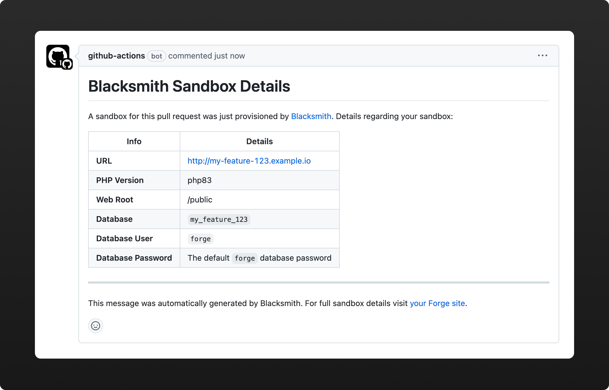

# ⚒️ Blacksmith CLI
### A Forge-provisioning CLI tool for sandboxes



## ✅ Requirements

When provisioning a sandbox you'll need:
- A Forge API token
- An ID of a Forge server to deploy to

It is imperative to leverage GitHub secrets to ensure you are not commit this type of sensitive data to your codebase and potentially exposing this data to the outside world.

## 🚀 Creating and destroying sandboxes

Below is an example of a GitHub action that will create a new sandbox when it is labeled with a "sandbox" tag in the pull request. When the pull request is closed it will run the decommission action.

```yaml
name: Sandbox

on:
  pull_request:
    types: [labeled, reopened, closed]

jobs:
  sandbox:
    if: contains(github.event.pull_request.labels.*.name, 'sandbox')
    runs-on: ubuntu-latest
    env:
      FORGE_APP_ID: app
      FORGE_DOMAIN: example.com
      FORGE_DEPLOY_SCRIPT: "npm install; npm run build"
      FORGE_TOKEN: ${{ secrets.BLACKSMITH_FORGE_TOKEN }}
      FORGE_SERVER: ${{ secrets.BLACKSMITH_SANDBOX_SERVER }}
      FORGE_REPO: ${{ github.repository }}
      FORGE_BRANCH: ${{ github.head_ref }}
      FORGE_PR_NUMBER: ${{ github.event.number }}
      FORGE_GITHUB_TOKEN: ${{ secrets.GITHUB_TOKEN }}
    steps:
    - uses: actions/checkout@v2
    - uses: shivammathur/setup-php@v2
      with:
        php-version: 8.3
        coverage: none
    - name: Install Blacksmith
      run: composer global require trendyminds/blacksmith-cli
    - name: Create Sandbox (If PR was just opened or reopened)
      if: github.event.action != 'closed'
      run: blacksmith create
    - name: Destroy Sandbox (When PR is closed)
      if: github.event.action == 'closed'
      run: blacksmith destroy
```

## ⚙️ Configuration options

| Environment Name                   |  Default value  |  Description                                                                                                               |
|------------------------------------|-----------------|----------------------------------------------------------------------------------------------------------------------------|
| `FORGE_TOKEN`                      |                 | The [API token](https://forge.laravel.com/docs/accounts/api) to use to authenticate to your Forge account                  |
| `FORGE_SERVER`                     |                 | The ID of the server to use when provisioning new sites                                                                    |
| `FORGE_APP_ID`                     |                 | The prefix for your domain and database                                                                                    |
| `FORGE_PR_NUMBER`                  |                 | The PR number for your sandbox pull request                                                                                |
| `FORGE_PHP_VERSION`                | `php83`         | The version of PHP to use                                                                                                  |
| `FORGE_DOMAIN`                     |                 | The domain to use (Ex: `domain.com`)                                                                                       |
| `FORGE_INSTALL_SSL`                | `false`         | When enabled, a Let's Encrypt SSL will be provisioned for the domain                                                       |
| `FORGE_DEPLOY_SCRIPT`              |                 | Additional steps to add to your deploy process. Use `;` to delineate between steps (Ex: `npm install; npm run build`)      |
| `FORGE_ENV_VARS`                   |                 | Environment variables to append (or replace if they already exist)                                                         |
| `FORGE_ENV_VARS`                   |                 | Environment variables to append (or replace if they already exist)                                                         |
| `FORGE_COMPOSER_INSTALL_ON_MOUNT`  | `true`          | If `composer install` should be ran when the repo is mounted.                                                               |
| `FORGE_ENABLE_DB`                  | `false`         | Whether your site needs a database. If `true` one will be created for you and shared in the post-deploy comment             |
| `FORGE_DB_PASSWORD`                |                 | The master password for your `forge` database user. This will be placed into your project's .env automatically              |
| `FORGE_BACKUP_PROVIDER`            |                 | When set and when your sandbox uses a database it will be backed up to this provider. Accepts `s3` or `spaces`              |
| `FORGE_BACKUP_REGION`              |                 | The region for the backup service you are using                                                                            |
| `FORGE_BACKUP_BUCKET`              |                 | The bucket to use for the backup                                                                                           |
| `FORGE_BACKUP_ACCESS_KEY`          |                 | The access key for connecting to the bucket                                                                                |
| `FORGE_BACKUP_SECRET_KEY`          |                 | The secret key for connecting to the bucket                                                                                |
| `FORGE_GITHUB_TOKEN`               |                 | Used to create a post-deploy comment within the pull request                                                               |
| `FORGE_REPO`                       |                 | The GitHub repo to deploy and mount for the sandbox generation (Ex: `myorg/repo`)                                          |
| `FORGE_BRANCH`                     |                 | The branch to use when mounting your repo to the site                                                                      |
| `FORGE_POST_MOUNT_COMMANDS`        |                 | Commands to run after the repository is first mounted. Use `;` to delineate between steps (Ex: `ls -lah; echo 'hi'`)       |
| `FORGE_PATH_TO_COMPOSER_FILE`      |                 | The path to your composer.json file if not in the root of the project (Ex: `src/`)                                         |

## 🔒 Backups

Unfortunately, Forge's backup configuration and storage processes are asynchronous and, because of this, a lengthy and arbitrary `sleep()` method is used when running these. That means it's _possible_ a database backup when your sandbox is decommissioned may not complete successfully. For tried-and-true backups consider running a separate backup process on Forge to ensure you have a method to restore databases if necessary.

##  Statamic notes

### Git Automation
Git automation should be enabled by including `STATAMIC_GIT_AUTOMATIC` in your environment variables and setting it to `false`.

This means content commits have to be manually performed by visiting Utilties > Git. However, it _greatly_ simplifies your sandbox:

1. You do not need to run Redis in every Statamic sandbox you create handling queued commits
2. You do not need to commit every single content save to your pull request if you do not queue your commits

While `STATAMIC_GIT_AUTOMATIC=false` means some occasional manual labor, it makes the setup simpler and also enables you to create Statamic sandboxes that _shouldn't_ have committed sandbox changes.
